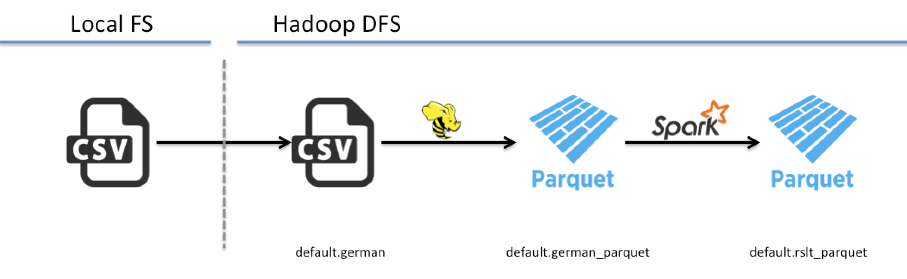

# GERMAN CREDIT
German Credit  
Created by Brad Barker (barker@cloudera.com)

<b>Status</b>: In Progress 
<b>Use Case</b>: German Credit

<b>Steps</b>: 

<b>Recommended Session Sizes</b>:

<b>Recommended Jobs/Pipeline</b>: 
NA

<b>Notes</b>:  

<b>Estimated Runtime</b>:  

<b>Demo Script</b> 

<b>Related Content</b>: 

The german credit analysis is to show some functions being evaluated for use in SA analytic engamgents including:

 * [magic](./init/cdh_magic.py) - Example script to load magics for common hadoop componants
 * [spark2_init](./init/spark2_init.py) - Which includes links to active application on hadoop
 

