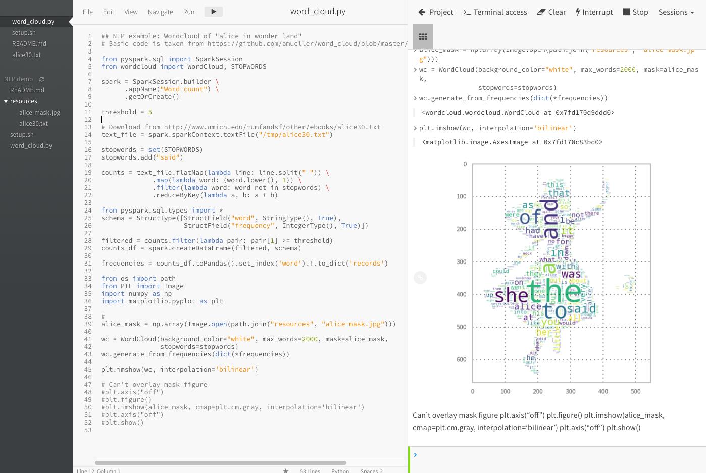

# NLP example: Wordcloud "ALICE'S ADVENTURES IN WONDERLAND"
Created by Aki Ariga (aki@cloudera.com) 

<b>Status</b>: Demo Ready 
<b>Use Case</b>: NLP + wordcloud visualization

<b>Steps</b>: 
1. Open workbench with Python engine
2. Run `cd wordcloud_alice && setup.sh` on your terminal or `! wordcloud_alice/setup.sh` on your console
3. Run `word_cloud.py` with your workbench

<b>Recommended Session Sizes</b>: 1 CPU, 2 GB RAM

<b>Estimated Runtime</b>:  
word_cloud.py --> < 30 secs 

<b>Recommended Jobs/Pipeline</b>: 
None

<b>Demo Script</b> 
TBD

<b>Related Content</b>: 
This code is inspired from https://github.com/amueller/word_cloud/blob/master/examples/masked.py

